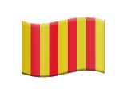
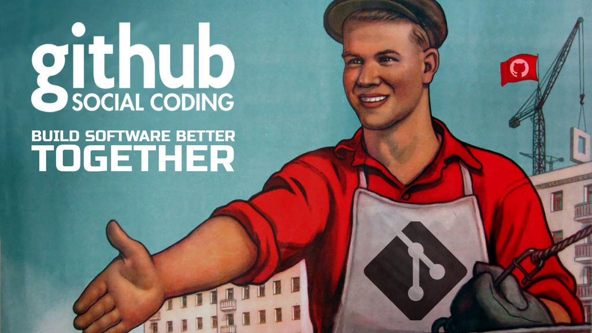

# Erik Ventura Gili

## English :

Hey there! I'm Erik Ventura Gili, a developer based in Catalonia who loves working on small personal projects and collaborating with friends. I speak Catalan and Spanish fluently, manage a B2 level in English, and can decipher a bit of French and Japanese (just enough to get into trouble 😅).

My main programming playground is C++. It's where I feel most at home, creating efficient and powerful solutions. But I'm also an enthusiastic Python user, enjoying its simplicity and versatility. I've also dabbled in web technologies like HTML and CSS, which come in handy when I want to put together a quick web project or tweak some UI. Learning is a continuous journey for me, whether it’s picking up a new language, diving into a new tech stack, or just exploring some fun facts to satisfy my curiosity.

Even though I primarily work in C++ and Python, I believe that good programming is more about understanding core concepts and problem-solving skills than just knowing syntax. If I need to work in a new language, I can pick up the syntax quickly with a bit of guidance and start writing code in no time. It's all about adapting to new challenges and expanding my skill set!

When I'm not coding, you’ll probably find me climbing rocks, hiking through scenic trails, or getting lost in a good book. I find that balancing my time between tech and the great outdoors keeps my mind fresh and my creativity flowing. If you’re interested in collaborating on a project or just want to chat about code, feel free to reach out. Let’s make some awesome stuff together!

## Català :

Ei! Sóc l'Erik Ventura Gili, un desenvolupador de Catalunya apassionat pels petits projectes personals i les col·laboracions amb amics. Parlo català i castellà a nivell nadiu, domino l'anglès a un nivell B2, i puc entendre una mica de francès i japonès (just el suficient per ficar-me en embolics 😅).

El meu terreny de joc principal és el C++, on em sento més còmode creant solucions eficients i potents. Però també sóc un entusiasta del Python, gaudint de la seva simplicitat i versatilitat. També he trastejat amb tecnologies web com HTML i CSS, que són útils quan vull muntar ràpidament un projecte web o ajustar alguna interfície d'usuari. L'aprenentatge és un viatge continu per a mi, ja sigui aprendre un nou llenguatge, submergir-me en una nova pila de tecnologia, o simplement explorar coses noves per satisfer la meva curiositat.

Tot i que principalment treballo amb C++ i Python, crec que programar bé és més sobre entendre els conceptes bàsics i tenir habilitats per resoldre problemes que simplement conèixer la sintaxi. Si necessito treballar en un nou llenguatge, puc aprendre la sintaxi ràpidament amb una mica de guia i començar a escriure codi de seguida. Es tracta d'adaptar-se a nous reptes i ampliar el meu conjunt d'habilitats!

Quan no estic programant, probablement em trobaràs escalant roques, fent senderisme per paisatges escènics, o perdut en un bon llibre. Trobo que equilibrar el meu temps entre la tecnologia i la natura manté la meva ment fresca i la creativitat fluint. Dóna un cop d'ull als meus repositoris i contacta'm si vols col·laborar en alguna cosa xula. Anem a fer coses genials junts!

---

  

## Contacte / Contact:

- **Correu electrònic / Email:** erik.ventura.gili@gmail.com
- **LinkedIn:** [linkedin.com/in/erik-ventura-gili](https://www.linkedin.com/in/erik-ventura-gili-77b378275/)

 

    

